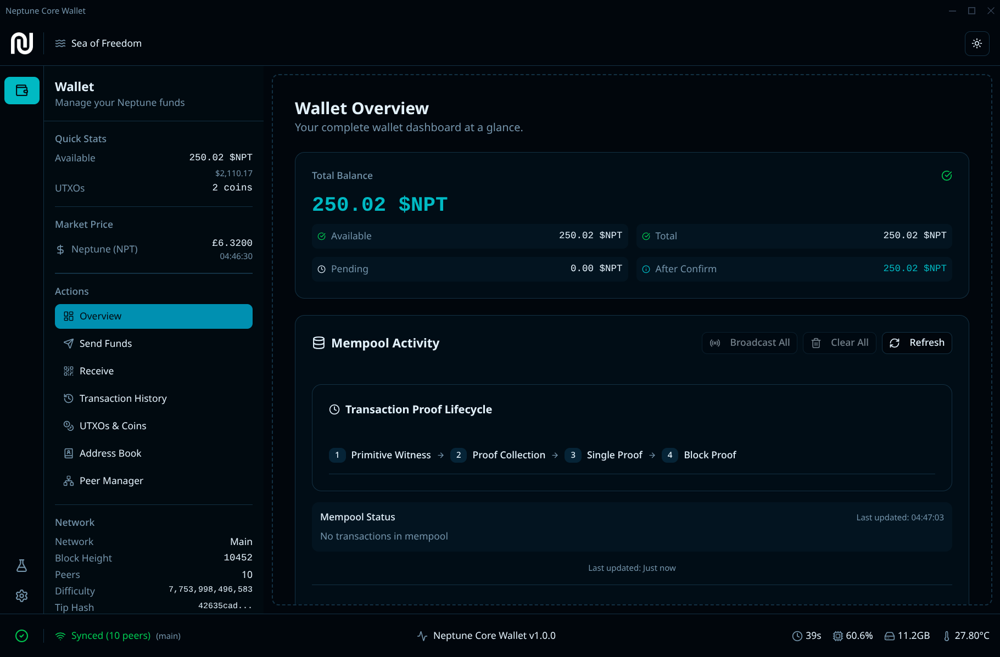

# Neptune Core Wallet

<div align="center">
  
</div>

> _"Different wars. Different continents. Different decades. But the same salvation: the sea."_

Throughout history, when oppression threatened freedom, people turned to the sea. They braved storms, uncertainty, and the unknown because the sea offered something precious: liberation from control, censorship, and authoritarian hands.

**Neptune is the boat that carries us to financial freedom.** A blockchain that cannot be censored, confiscated, or controlled. But every ship needs a wheel—a way to navigate the vast digital ocean and chart a course toward true sovereignty.

**Neptune Core Wallet is that wheel.** It's your compass through the cryptographic seas, your anchor in the storm of financial uncertainty, and your lighthouse guiding you to the shores of financial freedom.

_Sea of Freedom._

---

<div align="center">

**A privacy-preserving, quantum-resistant, zk-STARKs-based desktop wallet for the Neptune blockchain**

[](https://opensource.org/licenses/MIT)
[](https://www.typescriptlang.org/)
[](https://www.electronjs.org/)
[](https://reactjs.org/)

</div>

## ✨ Features

- 🔒 **Privacy-Preserving**: Advanced cryptographic techniques for transaction privacy
- 🛡️ **Quantum-Resistant**: Protection against future quantum computing threats
- ⚡ **zk-STARKs Technology**: Scalable, transparent, and secure proof systems
- 🖥️ **Cross-Platform**: Native desktop experience on Windows, macOS, and Linux
- 🎨 **Modern UI**: Beautiful, intuitive interface built with React and Tailwind CSS
- 🔧 **Developer-Friendly**: Built with TypeScript and modern web technologies

## 🚀 Quick Start

### Prerequisites

- Node.js 18+ and pnpm
- Git

### Installation & Development

```bash
# Clone the repository
git clone https://github.com/seaoffreedom/neptune-core-wallet.git
cd neptune-core-wallet

# Install dependencies
pnpm install

# Start development server
pnpm start

# Build for production
pnpm make
```

### Using Makefile (Recommended)

```bash
# Show all available commands
make help

# Start development
make dev

# Build and package
make build && make package

# Create distributables
make make
```

## 🏗️ Architecture

- **Main Process**: Node.js backend handling blockchain operations and IPC
- **Renderer Process**: React frontend with TanStack Router for navigation
- **Preload Scripts**: Secure context bridge for IPC communication
- **State Management**: Zustand for global state, React hooks for local state

## 🛠️ Development

### Code Quality

```bash
# Format and lint code
pnpm check

# Run tests
pnpm test

# Run E2E tests
pnpm test:e2e
```

### Build Commands

```bash
# Development
pnpm start

# Production build
pnpm make

# Package only
pnpm package
```

## 📦 Distribution

The wallet builds to native desktop applications:

- **Linux**: AppImage, deb, rpm packages
- **Windows**: exe installer
- **macOS**: dmg package

## 🔧 Configuration

The wallet supports extensive configuration through the settings interface:

- Network settings (mainnet, testnet, custom RPC)
- Mining configuration and resource management
- Security and privacy settings
- Performance optimization options

## 🤝 Contributing

We welcome contributions! Please see our [Contributing Guidelines](CONTRIBUTING.md) for details.

1. Fork the repository
2. Create a feature branch (`git checkout -b feature/amazing-feature`)
3. Commit your changes (`git commit -m 'Add amazing feature'`)
4. Push to the branch (`git push origin feature/amazing-feature`)
5. Open a Pull Request

## 📄 License

This project is licensed under the MIT License - see the [LICENSE](LICENSE) file for details.

## 🙏 Support the Project

Neptune Core Wallet is an open-source project built with passion for the Neptune blockchain ecosystem. If you find this wallet useful, please consider supporting its development:

<div align="center">

### 💝 Donate to Support Development

**Bitcoin**: `bc1q...` (coming soon)
**Ethereum**: `0x...` (coming soon)
**Neptune**: `neptune1...` (coming soon)

---

_Your support helps us maintain and improve the wallet, add new features, and ensure the best possible experience for the Neptune community._

**⭐ Star this repository if you find it helpful!**

</div>

---

<div align="center">
  <p>Built with ❤️ for the Neptune blockchain community</p>
  <p>
    <a href="https://github.com/seaoffreedom/neptune-core-wallet/issues">Report Bug</a>
    ·
    <a href="https://github.com/seaoffreedom/neptune-core-wallet/issues">Request Feature</a>
    ·
    <a href="https://github.com/seaoffreedom/neptune-core-wallet/discussions">Discussions</a>
  </p>
</div>
