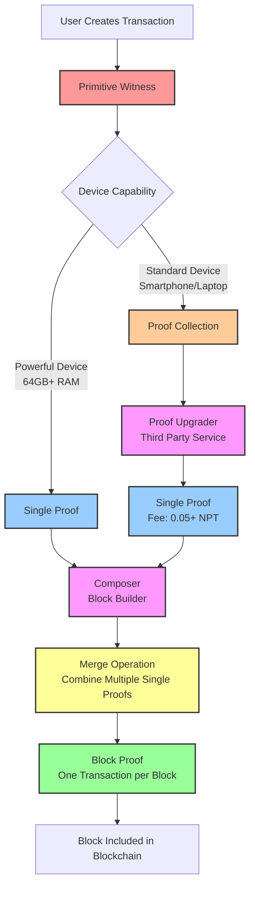

# Neptune Transaction Proof Lifecycle Diagram

## Key Stages:

1. **Primitive Witness** - Initial transaction with secret keys (cannot be shared)
2. **Proof Collection** - Generated by standard devices, requires third-party upgrading
3. **Single Proof** - Generated by powerful devices or upgraded from Proof Collection
4. **Block Proof** - Final proof included in Neptune block (one transaction per block)

## Fee Structure:

- **Proof Collection**: Expensive (0.05+ NPT) - requires third-party processing
- **Single Proof**: Cheap (0.02 NPT) - direct block inclusion capability

## Device Requirements:

- **Standard Devices**: Can generate Proof Collections
- **Powerful Devices** (64GB+ RAM): Can generate Single Proofs directly
